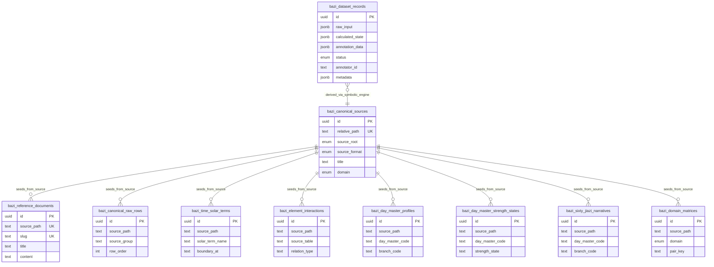

# Bazi SFT Dataset Collector - Project Map

## 1. 🧠 Philosophy (The Vibe)
**Bazi AI Annotation & Inference System**

โปรเจกต์นี้คือ Neuro-Symbolic AI Application สำหรับ 2 งานที่เชื่อมกันโดยตรง: คำนวณดวงจีนเชิงสัญลักษณ์ให้ถูกต้องก่อน แล้วใช้ผลลัพธ์นั้นเป็นฐานสำหรับงาน annotation / proofing เพื่อสร้าง dataset สำหรับ Supervised Fine-Tuning (SFT) ของ LLM

- **Symbolic-Engine First**: ทุก `calculated_state` ต้องมาจาก `symbolic-engine` เท่านั้น ห้ามให้ AI draft คิด state เอง
- **Contract Driven**: UI, API, DB, scripts และ proof flow ใช้ Zod/TypeScript contracts เดียวกันเป็น truth surface
- **Safety First**: migration, seeding, และ data export ต้อง deterministic และมี preflight guardrails
- **Human Proof Before Truth**: draft จาก AI เป็นเพียงร่าง ซินแสมนุษย์ต้อง proof และใส่ `sinsaeProofNote` ก่อนเลื่อนเป็น `reviewed`
- **Reading Surface, Not Dashboard**: ฝั่ง UI โดยเฉพาะหน้าอ่านผลและ reaction chamber ต้องคงความเป็น reading flow ไม่ยุบเป็นกล่องสถิติเฉย ๆ

## 2. 🗺️ Key Landmarks (The Territory)

### App Surfaces
- `src/app/page.tsx`
  - หน้า entry หลักของระบบ ใช้ `BaziTrainerWorkspace` และสลับได้ระหว่าง `manual` กับ `queue`
- `src/app/pending/page.tsx`
  - หน้า queue แบบ auth-protected สำหรับดู draft ที่รอ proof
- `src/app/proof/[id]/page.tsx`
  - หน้า proof workspace แบบ auth-protected สำหรับตรวจ แก้ อนุมัติ หรือตีกลับทีละเคส
- `src/app/reaction-chamber/page.tsx`
  - หน้ากราฟ semantic chamber เต็มหน้า โดยอ่าน session runtime จาก store ฝั่ง client
- `src/app/sign-in/[[...sign-in]]/page.tsx`
  - จุดเข้า auth ของ Clerk

### API Surfaces
- `src/app/api/bazi/calculate/route.ts`
  - รับ raw input แล้วคำนวณ `calculated_state` ผ่าน `calculateBaziChart`
- `src/app/api/dataset/drafts/route.ts`
  - คืน draft queue สำหรับ workspace คิวตรวจงาน AI
- `src/app/api/dataset/save/route.ts`
  - บันทึก record แบบ draft/reviewed/export pipeline ฝั่ง dataset session
- `src/app/api/dataset/proof/route.ts`
  - endpoint เฉพาะงาน proof ที่ต้อง validate annotation ตามสถานะจริง
- `src/app/api/dataset/purge-drafts/route.ts`
  - ล้าง draft ที่ operator ต้องการ purge อย่างมี auth guard
- `src/app/api/health/route.ts`
  - surface สำหรับเช็ก health/runtime readiness

### Core Domain & State
- `src/lib/bazi/schema-types.ts`
  - Zod contracts ของ raw input, calculated state, annotation data, และ saved payloads
- `src/lib/bazi/symbolic-engine.ts`
  - orchestration หลักของการคำนวณดวงจาก knowledge repository
- `src/lib/bazi/symbolic-engine.birth.ts`
  - parse เวลาเกิดและผูก logic จากข้อมูลผู้ใช้
- `src/lib/bazi/symbolic-engine.base-chart.ts`
  - คำนวณ 4 เสาและ base chart structure
- `src/lib/bazi/symbolic-engine.interactions.ts`
  - อ่านปฏิกิริยาและ relation ระหว่างธาตุ/เสา
- `src/lib/bazi/symbolic-engine.persona.ts`
  - สร้าง persona/narrative layers จาก canonical knowledge
- `src/lib/bazi/symbolic-engine.strength.ts`
  - คำนวณ strength state และ score vocabulary
- `src/lib/bazi/symbolic-engine.seasonal.ts`
  - seasonal context และ qi-related interpretation
- `src/lib/bazi/symbolic-engine.context-notes.ts`
  - สร้าง explanation/context notes สำหรับ UI และ annotation flow
- `src/lib/bazi/timezone.ts`
  - truth surface ของ local-time parsing และ HKT boundary comparison
- `src/lib/bazi/dataset-records.ts`
  - repository + handler factory สำหรับ save/list/proof/purge dataset records
- `src/lib/bazi/dataset-metadata.ts`
  - metadata model ของ queue batch, review state, supersede chain, source row, campaign และ provenance
- `src/lib/bazi/calculated-state-integrity.ts`
  - extra integrity checks ระหว่าง raw input กับ calculated state ก่อน save
- `src/lib/bazi/bazi-session-store.ts`
  - Zustand store ของ session ฝั่ง workspace หลัก (form, submitted input, calculated state)
- `src/lib/bazi/chamber-session-store.ts`
  - session store แยกสำหรับ reaction chamber fullscreen route
- `src/lib/bazi/semantic-chamber-graph.ts`
  - แปลง calculated state เป็น graph data สำหรับ React Flow โดยคง graph-first doctrine
- `src/lib/bazi/base-chart-chamber-graph.ts`
  - graph helper สำหรับ base chart / chamber-specific topology

### UI Composition
- `src/components/bazi/BaziTrainerWorkspace.tsx`
  - shell หลักของหน้า home ที่รวม manual workflow, queue workflow, state bridge และ URL sync
- `src/components/bazi/BirthForm.tsx`
  - แบบฟอร์มรับข้อมูลเกิดและ trigger การคำนวณ
- `src/components/bazi/CalculatedBoard.tsx`
  - summary reading surface หลักของดวงที่ตอนนี้เป็นจุดเชื่อมเข้า reaction chamber ผ่าน ribbon zone
- `src/components/bazi/PendingDraftQueue.tsx`
  - queue list ของ draft records พร้อม deep link เข้าหน้า proof
- `src/components/bazi/ProofWorkspace.tsx`
  - หน้าทำ proof/approve/reject พร้อมแก้ reasoning และ prediction
- `src/components/bazi/reaction-chamber/`
  - surface แยกของ chamber graph: shell, canvas, marker node, pillar node, inspector, command bar
- `src/components/bazi/primitives/`
  - primitive UI layer เช่น `Surface`, `SectionHeading`, `Action`, `Badge`, `StatusChip`

### Styling Ownership
- `src/styles/tokens/reference.css`
  - raw visual values, material tint, glow, gradients
- `src/styles/tokens/system.css`
  - semantic tokens ของ surface, text, line, emphasis, state roles
- `src/styles/foundation.css`
  - app-level baseline, shell defaults, global reading rhythm
- `src/styles/primitives.css`
  - reusable structural recipes ที่ผูกกับ primitive components
- `src/styles/features/`
  - feature-local ownership เช่น `workspace-shell.css`, `pending-proof.css`, `reading-insights.css`, `reaction-chamber.css`, `base-chart-reading.css`, `persona-strength.css`, `dynamic-temporal.css`
- `src/styles/bazi-spillover.css`
  - migration inventory เท่านั้น ไม่ใช่บ้านถาวรของ selector ใหม่
- `docs/oracle-ui-exemplar.md`
  - canonical map ของ frontend layer ownership สำหรับป้องกัน style drift

### Database / Tooling / Scripts
- `src/db/schema.ts`
  - Drizzle schema definition ของ dataset records และ canonical knowledge tables
- `src/db/client.ts`
  - DB client factory สำหรับ Neon/Drizzle
- `drizzle/`
  - SQL migrations แบบ deterministic
- `scripts/forbid-db-push.ts`
  - guardrail บังคับไม่ให้ใช้ `db push`
- `scripts/generate-phase16-migration.ts`, `apply-phase16-migration.ts`, `check-phase16-db-state.ts`, `verify-phase16-migration.ts`
  - phase 16 migration pipeline สำหรับ dataset/canonical schema
- `scripts/generate-phase6-dataset-metadata-migration.ts`, `apply-phase6-dataset-metadata-migration.ts`, `check-phase6-db-state.ts`, `verify-phase6-dataset-metadata-migration.ts`
  - metadata migration pipeline
- `scripts/seed-time-solar-terms.ts`, `scripts/seed-canonical-knowledge.ts`
  - canonical knowledge seeding
- `scripts/generate-random-bazi.ts`
  - queue master สำหรับ pre-generate raw input + calculated state
- `scripts/import-agent-drafts.ts`
  - importer ของ AI draft batches
- `scripts/generate-dataset-from-csv.ts`, `scripts/regenerate-dataset-records.ts`
  - tooling สำหรับ regenerate/backfill cases จาก source dataset
- `scripts/export-sft-dataset.ts`
  - local-only exporter สำหรับ `reviewed` records ไปเป็น JSONL
- `scripts/poc-personality-prompt.ts`
  - POC CLI สำหรับแปลง symbolic-engine truth ไปเป็นรายงาน `นิสัยพื้นฐาน` แบบภาษาซินแส เพื่อจูน prompt และ formatter ก่อนย้าย pattern ไปฝั่ง UI จริง

### Test Surfaces
- `tests/symbolic-engine.test.ts`, `tests/symbolic-engine.e2e.test.ts`
  - ครอบ symbolic engine ทั้ง unit และ end-to-end
- `tests/schema.test.ts`, `tests/dataset-save-route.test.ts`, `tests/dataset-purge-drafts-route.test.ts`
  - ครอบ schema contracts และ API persistence flow
- `tests/base-chart-chamber-graph.test.ts`, `tests/home-page.test.ts`, `tests/proof-workspace.test.ts`
  - ครอบ reading UI, chamber graph, และ proof workspace behavior
- `tests/pending-queue.test.ts`, `tests/trainer-workspace.test.ts`, `tests/bazi-session-store.test.ts`, `tests/chamber-session-store.test.ts`
  - ครอบ queue/session runtime surfaces

## 3. 🧱 Architecture Shape

### A. Manual Reading Workspace
- ผู้ใช้เริ่มที่หน้า `/`
- `BaziTrainerWorkspace` แยก mode เป็น `manual` หรือ `queue`
- ใน mode `manual`, `BirthForm` ส่ง raw input ไป `POST /api/bazi/calculate`
- ผลลัพธ์ถูกเก็บใน `bazi-session-store` และ render ผ่าน `CalculatedBoard`
- หน้า summary นี้เป็น primary reading surface และเป็นจุดเปิดไป reaction chamber

### B. Queue + Proof Workspace
- draft cases ถูกดึงจาก `GET /api/dataset/drafts`
- หน้า `/pending` และ queue mode ใน `/` ใช้ `PendingDraftQueue` แสดงรายการที่รอ proof
- เมื่อเปิด `/proof/[id]`, ระบบโหลด `ProofDatasetRecord` จาก `dataset-records.ts`
- ซินแสมนุษย์แก้ annotation แล้วส่งกลับ `POST /api/dataset/proof`
- สถานะ `reviewed`/`rejected` ต้องมี `sinsaeProofNote` และผ่าน schema validation ตามสถานะจริง

### C. Reaction Chamber Surface
- หน้า `/reaction-chamber` เป็น fullscreen interpretive graph route
- route นี้พึ่งพา session runtime ใน `bazi-session-store`; ถ้าไม่มี state จะ redirect กลับ `/`
- `ReactionChamberShell` สร้าง graph จาก `buildSemanticChamberGraph(calculatedState)`
- UI แยกเป็น canvas + inspector + command bar และสลับ variant ระหว่าง `docked` กับ `sheet` ตาม viewport
- chamber route ต้องคง `graph-first` เป็นหลัก และใช้ school/cluster overlays เป็น explanatory layer เท่านั้น

### D. Dataset Production Pipeline
- operator หรือ script สร้าง pending queue ผ่าน `scripts/generate-random-bazi.ts`
- AI pipeline อ่าน queue แล้วสร้าง draft annotations
- `scripts/import-agent-drafts.ts` validate draft และ import เข้าฐานข้อมูล
- มนุษย์ proof ต่อใน UI จนได้ `reviewed`
- `scripts/export-sft-dataset.ts` export เฉพาะ record ที่ผ่าน review แล้วออกนอกระบบเป็น training artifact
- `scripts/poc-personality-prompt.ts` ใช้เป็นสนามทดลอง headless สำหรับปรับ output ให้เห็นลำดับ `แกนดวง -> สัญญาณ -> คำอธิบายแบบซินแส -> ข้อความพร้อมส่งลูกค้า` ก่อนนำ pattern เดียวกันไปใช้ในหน้า proof

## 4. 🗄️ Database Schema

ฐานข้อมูลแบ่งเป็น 2 กลุ่มใหญ่: `dataset production` และ `canonical knowledge repository`

### Core Tables
- `bazi_dataset_records`
  - ตารางศูนย์กลางของเคสทั้งหมด
  - เก็บ `raw_input`, `calculated_state`, `annotation_data`, `status`, `annotator_id`, `metadata`
  - ใช้ `CHECK` constraint `bazi_dataset_records_reviewed_content_check` บังคับว่า `reviewed` และ `rejected` ต้องมี proof note และโครงสร้างที่ครบตามสถานะ
- `bazi_canonical_sources`
  - registry ของ canonical source files ที่ถูก seed เข้า DB
- `bazi_reference_documents`
  - เอกสาร reference แบบ full text สำหรับ retrieval/narrative lookup
- `bazi_canonical_raw_rows`
  - เก็บ raw rows จากตารางต้นทางเพื่อ audit และ parse logic

### Canonical Knowledge Tables
- `bazi_time_solar_terms`
  - boundary truth ของ solar terms สำหรับ HKT comparisons
- `bazi_faq_taxonomies`
  - taxonomy ของคำถาม/intent สำหรับจัดโดเมนความหมาย
- `bazi_element_interactions`
  - กฎ relation ระหว่าง symbols/ธาตุที่ symbolic engine อ้างอิง
- `bazi_twelve_qi_stages`
  - rollback/audit surface ชั่วคราว; runtime หลักย้ายไปใช้ orthodox math แล้ว
- `bazi_day_master_profiles`
  - personality/profile narratives ตาม day master + branch
- `bazi_day_master_strength_states`
  - state vocabulary ของความแข็งแรง/อ่อนแรง
- `bazi_sixty_jiazi_narratives`
  - narrative สำหรับคู่ day master + branch แบบ 60 Jiazi
- `bazi_domain_matrices`
  - domain-specific matrices เช่น `love` และ `work`

### Relationships
- `bazi_dataset_records` ไม่มี foreign key เชิง relational ไป canonical tables โดยตรง
  - ความสัมพันธ์เป็นแบบ derived relationship: `calculated_state` อ้างความรู้จาก canonical repository ตอนคำนวณ แล้วเก็บผลลัพธ์แบบ denormalized ลง record
- canonical tables หลายตัวผูกกันด้วย `sourcePath` / `relativePath` / `metadata` มากกว่า explicit FK
  - นี่เป็น intentional ingestion shape เพื่อให้ import จาก CSV/markdown/xlsx ทำได้ยืดหยุ่นและ audit ย้อนกลับได้
- `metadata` ของ `bazi_dataset_records` เป็นตัวเก็บ provenance chain เช่น queue batch, campaign, review state, superseded record, latest effective record

### ER Sketch

## 5. 🔄 Data Flow (The Pulse)

### Flow 1: Manual Calculation
1. Human กรอกข้อมูลเกิดใน `BirthForm`
2. UI ส่ง payload ไป `POST /api/bazi/calculate`
3. `calculateBaziChart` อ่าน canonical knowledge จาก DB แล้วสร้าง `calculated_state`
4. client store เก็บ `submittedInput` + `calculatedState`
5. `CalculatedBoard` แสดง summary reading, ribbon zones, persona/strength insights, และ deep link ไป chamber

### Flow 2: Chamber Exploration
1. summary page seed session เข้า `bazi-session-store`
2. ผู้ใช้เปิด `/reaction-chamber`
3. `ReactionChamberShell` สร้าง semantic graph จาก state เดิม
4. operator inspect node/edge/marker ผ่าน canvas + inspector
5. ถ้า session หาย route จะ redirect กลับ summary แทนการสร้าง state ใหม่เอง

### Flow 3: Queue Draft Ingestion
1. `scripts/generate-random-bazi.ts` สร้าง pending queue ที่มี raw input + calculated state จาก symbolic engine
2. AI draft pipeline สร้าง annotation draft เป็น batch
3. `scripts/import-agent-drafts.ts` validate ด้วย `DraftAnnotationDataSchema`
4. import เป็น `draft` ลง `bazi_dataset_records`

### Flow 4: Human Proofing
1. หน้า `/pending` หรือ queue mode ดึงรายการ draft ผ่าน `GET /api/dataset/drafts`
2. operator เข้า `/proof/[id]`
3. แก้ thought process / final prediction / proof note ใน `ProofWorkspace`
4. `POST /api/dataset/proof` validate ตามสถานะ `draft|reviewed|rejected`
5. DB constraint ตรวจซ้ำอีกชั้นก่อน persist จริง

### Flow 5: Export / Regeneration
1. เคสที่ `reviewed` แล้วเท่านั้นจึงเข้าสู่ export flow
2. `scripts/export-sft-dataset.ts` ดึงข้อมูลจาก DB แล้วแปลงเป็น JSONL local artifact
3. regeneration/backfill tools ใช้เมื่อมีการปรับ metadata หรือ import source ใหม่ โดยไม่ย้าย export concern ไปอยู่ใน UI

## 6. 🐉 Challenges & Known Dragons
- **ORM Tooling Limitations**: `drizzle-kit push` / interactive migrate มีปัญหากับ Neon serverless driver และ non-TTY environment -> *Solution*: ใช้ deterministic generation/apply/check scripts และห้าม `db push`
- **Deep Reasoning Validation**: annotation data เป็น JSONB 15 มิติที่มีความเสี่ยงเรื่อง shape drift -> *Solution*: validate ทั้งชั้น Zod และ DB `CHECK` constraint
- **Timezone Normalization**: canonical solar-term truth อยู่ใน HKT แต่เสาหลักต้องผูกจากเวลาเกิด local ของผู้ใช้ -> *Solution*: derive chart จาก local time ก่อน แล้วค่อย compare boundary ใน HKT สำหรับ context เพิ่มเติม
- **Canonical Knowledge Drift**: canonical tables หลายตัวเชื่อมกันผ่าน source metadata มากกว่า FK ตรง -> *Solution*: ใช้ source path / normalized table / metadata เป็น audit trail และ seed แบบ deterministic
- **Agent Draft Integrity**: AI draft ห้ามสร้าง `calculated_state` เองและห้าม bypass `sinsaeProofNote` -> *Solution*: queue ต้อง symbolic-engine-first และ review gate ต้อง require proof note
- **Review Lineage Complexity**: draft/proof flow มี supersede chain, latest effective record และ stale reasons อยู่ใน metadata มากกว่า relational joins -> *Solution*: รักษา provenance ใน metadata และให้ repository layer เป็นผู้ตีความ
- **Runtime Session Dependency**: reaction chamber และ reading flow พึ่ง client session store ถ้าหลุด refresh จะไม่มี chart context -> *Solution*: redirect กลับ summary อย่างชัดเจน แทนการเดาข้อมูลหรือสร้าง state ปลอม
- **Graph Density & Visual Truth**: chamber graph อาจผ่าน test แต่ยัง fail ทางสายตาเมื่อ marker/edge หนาแน่น -> *Solution*: แยก browser truth เป็น gate เพิ่มจาก hard gate ปกติ และเตรียมขยับไป lane-aware layout หาก density โตขึ้น
- **Style Ownership Drift**: ถ้า selector ใหม่ถูกทิ้งลง global/spillover โดยไม่ classify ก่อน สถาปัตยกรรม UI จะย้อนเป็นกองเดียว -> *Solution*: ยึด layer map ใน `docs/oracle-ui-exemplar.md` และลง selector ตาม ownership จริง
- **Privacy Boundary**: export training data ไม่ควรโผล่เป็นปุ่มใน UI proof ของซินแส -> *Solution*: คง export เป็น local-only headless script

## 7. 🛡️ Testing & Hard Gate Doctrine

### Default Developer Gate
- งาน feature ปกติของ Bazi ต้องยึด default gate นี้เป็นสัญญาณหลักก่อนเดินงานต่อ:
  1. `npm run gate:default`
  2. `npx vitest run <affected fast slice>` เมื่อมี focused test ของ surface ที่เพิ่งแก้
- ถ้างานแตะ runtime-critical path ต่อไปนี้ ให้รัน baseline runtime suite เพิ่ม แม้ไฟล์ที่แก้จะไม่ใช่ test โดยตรง:
  - `src/lib/bazi/symbolic-engine.ts`
  - `src/lib/bazi/dataset-records.ts`
  - `src/app/api/bazi/calculate/route.ts`
  - `src/app/api/dataset/**`
  - `src/lib/bazi/schema-types.ts`
- canonical baseline runtime suite ถูกล็อกไว้ใน `npm run test:runtime-critical` และถูกเรียกจาก `npm run gate:default`
- `npm test` ทั้งชุดไม่ใช่ default gate สำหรับ feature slice ทั่วไป และไม่ควรใช้ block งานที่ไม่ได้แตะ corpus/build-wide surfaces

### Heavy Verification Lane
- งานที่แตะ corpus-wide truth, build artifacts, หรือ deterministic full-range generators ต้องรัน heavy lane แยกจาก default gate
- canonical heavy lane command คือ `npm run gate:heavy-lane`
- heavy lane surface หลักถูกล็อกไว้ใน `npm run test:heavy-lane` และ `npm run build:knowledge`
- `npm test` ทั้งชุดยังใช้ได้เป็น exploratory/full-suite signal แต่ไม่ใช่ canonical feature continuity gate
- heavy lane เป็น required gate เมื่อมีการแก้ knowledge builders, corpus generation, compiled artifacts, seeding flow, หรือ orchestration path ที่กิน compute ทั้งก้อน

### Test Placement Rule
- test ใหม่ควรอยู่ใน default lane ถ้ามันปกป้อง runtime-critical behavior, deterministic, และรันได้ในวงรอบ feature ปกติ
- test ใหม่ควรอยู่ใน heavy lane ถ้ามันต้อง rebuild corpus, generate broad artifact, seed large knowledge sets, หรือพิสูจน์ full-range truth ที่ไม่จำเป็นต่อ feature slice ทั่วไป
- ถ้า test เดิมเริ่มช้าเพราะ recompute truth ซ้ำ ให้แก้ที่ fixture reuse / caching / lane classification ก่อนเพิ่ม timeout

### Continuity Rule
- known-red ชั่วคราว, timeout investigations, และ phase progress ต้องเก็บใน Oracle memory artifacts ไม่ใช่ใน `project_map.md`
- ถ้า default gate ผ่าน แต่ heavy lane ยังมี noise ที่ไม่เกี่ยวกับ slice ปัจจุบัน ให้ถือว่า feature continuity ยังเดินต่อได้ โดยต้องอ้างอิง snapshot ล่าสุดที่บอก risk boundary ไว้ชัดเจน
- เมื่อมีข้อสงสัยว่าควรวาง test ไว้ lane ไหน ให้ถามก่อนว่า test นั้นปกป้อง runtime user path หรือ corpus/build truth เป็นหลัก แล้วจัดตาม dominant truth นั้น

## 8. ✅ Recent Structural Changes Reflected In This Map
- เพิ่ม reaction chamber fullscreen route และ semantic graph layer เป็น landmark ถาวรของระบบ
- ย้าย CTA ของ chamber เข้าสู่ ribbon zone บน summary surface แทน section แยก
- ยอมรับชัดเจนว่า browser truth เป็น verification layer สำคัญสำหรับ graph-heavy UI
- อัปเดต database map ให้สะท้อน canonical knowledge repository และ metadata-driven review lineage
