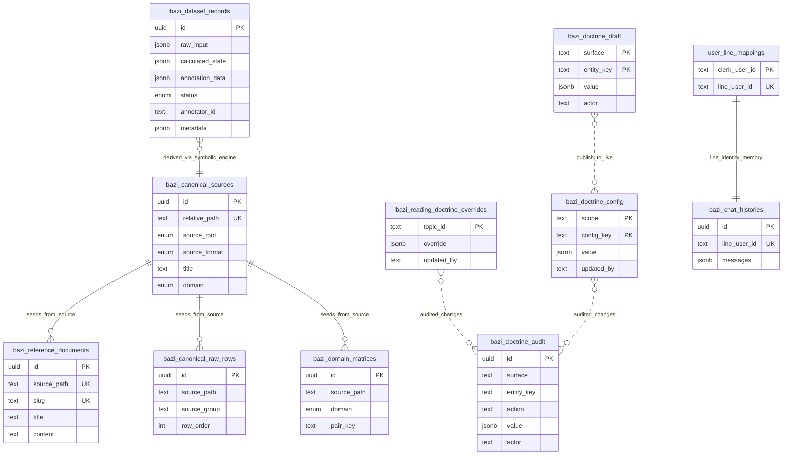

# Bazi SFT Dataset Collector - Project Map

## 1. 🧠 Philosophy (The Vibe)
**Deterministic Bazi Platform for Reading, Proof, Matching, and Conversation**

โปรเจกต์นี้ไม่ใช่แค่หน้า annotate dataset อีกต่อไป แต่เป็นแพลตฟอร์ม Bazi ที่ใช้ **truth จาก symbolic engine ชุดเดียว** ไปเลี้ยงหลาย surface พร้อมกัน: คำนวณดวง, อ่านรายบท, proof dataset, เปรียบเทียบคู่รัก/การงาน, export รายงาน, และ lane สนทนาอย่าง Open WebUI กับ LINE

- **Symbolic-Engine First**: ทุก `calculated_state` ต้องมาจาก engine ที่ deterministic เท่านั้น ห้ามให้ LLM หรือ operator เดา state เอง
- **One Truth Packet, Many Surfaces**: manual UI, reading path, pair/work matching, docx export, chat lane, และ proof pipeline ต้องใช้ raw input + calculated state ชุดเดียวกัน
- **Doctrine Tunable, Logic Guarded**: ซินแสปรับภาษาอ่าน, ลำดับขั้น, ป้าย role/star ได้ผ่าน doctrine/config/draft surfaces แต่ logic ของ engine ยังอยู่ในโค้ดและ contracts
- **Contract Driven**: API, DB, scripts, และ UI ใช้ TypeScript/Zod/Drizzle contracts เดียวกันเป็น truth surface
- **Safety First**: migration, seeding, queue generation, publish doctrine, และ export flows ต้อง deterministic และมี guardrails ชัดเจน
- **Human Proof Before Truth**: AI draft เป็นเพียงร่าง มนุษย์ proof ต้องอนุมัติพร้อม `sinsaeProofNote` ก่อนเลื่อนเป็น `reviewed`
- **Reading Surface, Not Dashboard**: หน้าอ่านผลและ reading path ต้องคง flow การตีความ ไม่ยุบเป็นแค่สรุปตัวเลขหรือการ์ดสถิติ

## 2. 🗺️ Key Landmarks (The Territory)

### App Surfaces
- `src/app/page.tsx`
  - หน้า entry หลักของระบบ ใช้ `BaziTrainerWorkspace` เป็น home shell สำหรับ manual + queue workflow และเป็นประตูไป `reading`, `pair-matching`, `work-matching`
- `src/app/reading/page.tsx`
  - หน้า Stepwise Path Reading สำหรับอ่านดวงทีละหัวข้อจาก engine truth และเลือกเรียบเรียงด้วย LLM
- `src/app/reading/doctrine/page.tsx`
  - หน้า admin สำหรับแก้ topic doctrine override รายบทแบบ online
- `src/app/reading/doctrine-config/page.tsx`
  - หน้า admin สำหรับแก้ doctrine config v2 ระดับ step / role / star
- `src/app/reading/doctrine-audit/page.tsx`
  - หน้า audit / rollback ประวัติการแก้ doctrine
- `src/app/pair-matching/page.tsx`
  - หน้าเปรียบเทียบคู่รัก 2 คน โดยยึด matrix คู่สมพงษ์ด้านความรัก
- `src/app/work-matching/page.tsx`
  - หน้าเปรียบเทียบการงานแบบ “เรา + ผู้ร่วมงานสูงสุด 3 คน” พร้อมจัดอันดับจากคะแนนทิศ forward
- `src/app/pending/page.tsx`
  - หน้า queue แบบ auth-protected สำหรับดู draft ที่รอ proof
- `src/app/proof/[id]/page.tsx`
  - หน้า proof workspace แบบ auth-protected สำหรับตรวจ แก้ อนุมัติ หรือตีกลับทีละเคส
- `src/app/reaction-chamber/page.tsx`
  - หน้ากราฟ semantic chamber เต็มหน้า โดยอ่าน session runtime จาก store ฝั่ง client
- `src/app/sign-in/[[...sign-in]]/page.tsx`
  - จุดเข้า auth ของ Clerk

### API Surfaces
- `src/app/api/bazi/calculate/route.ts`
  - รับ raw input แล้วคำนวณ `calculated_state` ผ่าน bazi math adapter
- `src/app/api/bazi/pair/route.ts`
  - คำนวณดวง 2 คนแล้วคืนผล pair comparison ด้านคู่รัก
- `src/app/api/bazi/pair/rephrase/route.ts`
  - เรียบเรียงผล pair/work engine text ด้วย LLM
- `src/app/api/bazi/work/route.ts`
  - คำนวณดวงเรา + candidates 1..3 คน แล้วคืน work ranking/comparison
- `src/app/api/reading/topic/route.ts`
  - owner หลักของ stepwise reading: คำนวณ state, merge doctrine/config/drafts, สร้าง engine/consumer/llm reading ต่อบท
- `src/app/api/reading/export-docx/route.ts`
  - export รายงาน `.docx` จาก raw input + calculated state + reading overrides
- `src/app/api/reading/doctrine/route.ts`
  - live override ของ topic definition รายบท
- `src/app/api/reading/doctrine-config/route.ts`
  - live override ของ config ระดับ step/role/star
- `src/app/api/reading/doctrine-draft/route.ts`
  - draft overlay สำหรับ preview/edit ก่อน publish doctrine/config
- `src/app/api/reading/doctrine-audit/route.ts`
  - audit + restore surfaces ของการแก้ doctrine
- `src/app/api/reading/rules/route.ts`
  - คืน substitution rules ที่ใช้แทนคำของซินแสในผลอ่าน
- `src/app/api/dataset/drafts/route.ts`
  - คืน draft queue สำหรับ workspace คิวตรวจงาน AI
- `src/app/api/dataset/save/route.ts`
  - บันทึก record แบบ draft/reviewed/export pipeline ฝั่ง dataset session
- `src/app/api/dataset/proof/route.ts`
  - endpoint เฉพาะงาน proof ที่ต้อง validate annotation ตามสถานะจริง
- `src/app/api/dataset/purge-drafts/route.ts`
  - ล้าง draft ที่ operator ต้องการ purge อย่างมี auth guard
- `src/app/api/v1/chat/completions/route.ts`
  - Open WebUI-compatible SSE chat surface ที่ route intent, extract Bazi context, สร้าง truth packet, และ stream คำตอบกลับ
- `src/app/api/v1/models/route.ts`
  - model registry surface สำหรับ Open WebUI compatibility
- `src/app/api/webhooks/line/route.ts`
  - LINE webhook surface สำหรับ inbound events + auth/messaging orchestration
- `src/app/api/health/route.ts`
  - surface สำหรับเช็ก health/runtime readiness

### Core Domain & State
- `src/features/bazi-math/bazi-engine-adapter.ts`
  - canonical adapter ที่คั่น boundary ระหว่าง app/API กับ symbolic engine truth
- `src/lib/bazi/schema-types.ts`
  - Zod contracts ของ raw input, calculated state, annotation data, reading payloads, และ saved payloads
- `src/lib/bazi/symbolic-engine.ts`
  - orchestration หลักของการคำนวณดวงจาก knowledge repository
- `src/lib/bazi/symbolic-engine.birth.ts`
  - parse เวลาเกิดและผูก logic จากข้อมูลผู้ใช้
- `src/lib/bazi/symbolic-engine.base-chart.ts`
  - คำนวณ 4 เสาและ base chart structure
- `src/lib/bazi/symbolic-engine.interactions.ts`
  - อ่านปฏิกิริยาและ relation ระหว่างธาตุ/เสา
- `src/lib/bazi/symbolic-engine.persona.ts`
  - สร้าง persona/narrative layers จาก canonical knowledge
- `src/lib/bazi/symbolic-engine.strength.ts`
  - คำนวณ strength state และ score vocabulary
- `src/lib/bazi/symbolic-engine.seasonal.ts`
  - seasonal context และ qi-related interpretation
- `src/lib/bazi/symbolic-engine.context-notes.ts`
  - สร้าง explanation/context notes สำหรับ UI และ annotation flow
- `src/lib/bazi/symbolic-engine.repository.ts`
  - DB-backed knowledge repository สำหรับ engine
- `src/lib/bazi/timezone.ts`
  - truth surface ของ local-time parsing และ HKT boundary comparison
- `src/lib/bazi/pair-matching.ts`
  - core engine ของ pair comparison และ work comparison/ranking
- `src/lib/bazi/pair-types.ts`
  - contracts ของ pair/work comparison result
- `src/lib/bazi/topic-reading.ts`
  - builder ของ engine reading packet ราย topic
- `src/lib/bazi/topic-knowledge.ts`
  - narrative composer รายบท ทั้ง engine และ consumer reading
- `src/lib/bazi/reading-llm.ts`
  - LLM polishing layer สำหรับ topic reading และ pair/work rephrase
- `src/lib/bazi/reading-docx.ts`
  - owner หลักของ Word export pipeline
- `src/lib/bazi/reading-doctrine.server.ts`
  - โหลด merged doctrine ที่ publish แล้วสำหรับ reading runtime
- `src/lib/bazi/reading-doctrine-override.ts`
  - schema/merge logic ของ topic override
- `src/lib/bazi/doctrine-config.ts`, `doctrine-config.server.ts`
  - schema + runtime merge ของ doctrine config v2 (steps/roles/stars)
- `src/lib/bazi/doctrine-draft-repository.ts`, `doctrine-publish.service.ts`, `doctrine-audit.service.ts`
  - owner ของ draft overlay, publish, rollback, และ audit trail
- `src/lib/bazi/substitution-rules.ts`, `substitution-rules-store.ts`
  - กฎแทนคำของซินแสที่ apply ข้าม reading surfaces
- `src/lib/bazi/sinsae-corrections.ts`
  - local correction memory/fingerprint สำหรับ stepwise reading path
- `src/lib/bazi/dataset-records.ts`
  - repository + handler factory สำหรับ save/list/proof/purge dataset records
- `src/lib/bazi/dataset-metadata.ts`
  - metadata model ของ queue batch, review state, supersede chain, source row, campaign และ provenance
- `src/lib/bazi/calculated-state-integrity.ts`
  - extra integrity checks ระหว่าง raw input กับ calculated state ก่อน save
- `src/lib/bazi/bazi-session-store.ts`
  - Zustand store ของ session ฝั่ง workspace หลัก (form, submitted input, calculated state)
- `src/lib/bazi/chamber-session-store.ts`
  - session store แยกสำหรับ reaction chamber fullscreen route
- `src/lib/bazi/semantic-chamber-graph.ts`, `base-chart-chamber-graph.ts`
  - graph builders สำหรับ reaction chamber / base chart topology

### Integration Slices
- `src/features/open-webui/`
  - phase-oriented chat lane: payload guard, intent routing, Bazi context extraction, Gemini adapter, SSE streamer, truth packet
- `src/features/line-chat/`
  - LINE webhook/auth/memory/messaging integration โดยใช้ DB-backed short-term memory

### UI Composition
- `src/components/bazi/BaziTrainerWorkspace.tsx`
  - shell หลักของหน้า home ที่รวม manual workflow, queue workflow, และ CTA ไป reading/pair/work surfaces
- `src/components/bazi/BirthForm.tsx`
  - แบบฟอร์มรับข้อมูลเกิดและ trigger การคำนวณ
- `src/components/bazi/CalculatedBoard.tsx`
  - summary reading surface หลักของดวงที่เป็นจุดเชื่อมเข้า reaction chamber
- `src/components/bazi/PendingDraftQueue.tsx`
  - queue list ของ draft records พร้อม deep link เข้าหน้า proof
- `src/components/bazi/ProofWorkspace.tsx`
  - หน้าทำ proof/approve/reject พร้อมแก้ reasoning และ prediction
- `src/components/bazi/reading/ReadingPathWorkspace.tsx`
  - orchestrator ของหน้าอ่านรายบท, batch reading, local correction memory, และ print preview
- `src/components/bazi/reading/TopicCard.tsx`
  - card รายบทที่รองรับ engine / consumer / llm modes และ sinsae correction tools
- `src/components/bazi/reading/ReadingPrintDocument.tsx`, `PagedPreview.tsx`
  - print/PDF preview surface สำหรับรายงานอ่านดวง
- `src/components/bazi/reading/SinsaeRuleBuilder.tsx`
  - builder สำหรับเสนอ substitution rules จากคำแก้ของซินแส
- `src/components/bazi/pair/PairMatchingWorkspace.tsx`
  - UI เปรียบเทียบคู่รัก 2 คน
- `src/components/bazi/pair/WorkMatchingWorkspace.tsx`
  - UI เปรียบเทียบการงานและจัดอันดับผู้ร่วมงานสูงสุด 3 คน
- `src/components/bazi/pair/PairPrintReport.tsx`, `WorkPrintReport.tsx`
  - print/PDF report surfaces ของ pair/work matching
- `src/components/bazi/pair/PersonInputs.tsx`, `PairDetailModal.tsx`, `pair-presentation.ts`
  - shared input/presentation layer สำหรับ pair/work features
- `src/components/bazi/reaction-chamber/`
  - surface แยกของ chamber graph: shell, canvas, marker node, pillar node, inspector, command bar
- `src/components/bazi/primitives/`
  - primitive UI layer เช่น `Surface`, `SectionHeading`, `Action`, `Badge`, `StatusChip`

### Styling Ownership
- `src/styles/tokens/reference.css`
  - raw visual values, material tint, glow, gradients
- `src/styles/tokens/system.css`
  - semantic tokens ของ surface, text, line, emphasis, state roles
- `src/styles/foundation.css`
  - app-level baseline, shell defaults, global reading rhythm
- `src/styles/primitives.css`
  - reusable structural recipes ที่ผูกกับ primitive components
- `src/styles/features/`
  - feature-local ownership เช่น `workspace-shell.css`, `pending-proof.css`, `reading-insights.css`, `reaction-chamber.css`, `base-chart-reading.css`, `persona-strength.css`, `dynamic-temporal.css`, `pair-matching.css`
- `src/styles/bazi-spillover.css`
  - migration inventory เท่านั้น ไม่ใช่บ้านถาวรของ selector ใหม่
- `docs/oracle-ui-exemplar.md`
  - canonical map ของ frontend layer ownership สำหรับป้องกัน style drift

### Database / Tooling / Scripts
- `src/db/schema.ts`
  - Drizzle schema definition ของ dataset records, canonical knowledge, doctrine tables, และ chat memory tables
- `src/db/client.ts`
  - DB client factory สำหรับ Neon/Drizzle
- `drizzle/`
  - SQL migrations แบบ deterministic
- `scripts/forbid-db-push.ts`
  - guardrail บังคับไม่ให้ใช้ `db push`
- `scripts/generate-phase16-migration.ts`, `apply-phase16-migration.ts`, `check-phase16-db-state.ts`, `verify-phase16-migration.ts`
  - phase 16 migration pipeline สำหรับ dataset/canonical schema
- `scripts/generate-phase6-dataset-metadata-migration.ts`, `apply-phase6-dataset-metadata-migration.ts`, `check-phase6-db-state.ts`, `verify-phase6-dataset-metadata-migration.ts`
  - metadata migration pipeline
- `scripts/seed-time-solar-terms.ts`, `scripts/seed-canonical-knowledge.ts`
  - canonical knowledge seeding
- `scripts/generate-random-bazi.ts`
  - queue master สำหรับ pre-generate raw input + calculated state
- `scripts/import-agent-drafts.ts`
  - importer ของ AI draft batches
- `scripts/generate-dataset-from-csv.ts`, `scripts/regenerate-dataset-records.ts`, `scripts/backfill-dataset-metadata-from-csv.ts`
  - tooling สำหรับ generate/regenerate/backfill dataset records และ metadata
- `scripts/export-sft-dataset.ts`
  - local-only exporter สำหรับ `reviewed` records ไปเป็น JSONL
- `scripts/export-reading-docx.ts`
  - headless CLI exporter สำหรับรายงานอ่านดวง `.docx`

### Test Surfaces
- `tests/symbolic-engine.test.ts`, `tests/symbolic-engine.e2e.test.ts`
  - ครอบ symbolic engine ทั้ง unit และ end-to-end
- `tests/schema.test.ts`, `tests/dataset-save-route.test.ts`, `tests/dataset-purge-drafts-route.test.ts`
  - ครอบ schema contracts และ API persistence flow
- `tests/base-chart-chamber-graph.test.ts`, `tests/home-page.test.ts`, `tests/proof-workspace.test.ts`
  - ครอบ reading UI, chamber graph, และ proof workspace behavior
- `tests/pending-queue.test.ts`, `tests/trainer-workspace.test.ts`, `tests/bazi-session-store.test.ts`, `tests/chamber-session-store.test.ts`
  - ครอบ queue/session runtime surfaces
- `tests/pair-matching.test.ts`
  - ครอบ pair/work matching logic และ ranking behavior
- `tests/reading-topic-route.test.ts`, `tests/reading-docx.test.ts`, `tests/reading-export-docx-route.test.ts`, `tests/reading-llm-guard.test.ts`, `tests/reading-doctrine.test.ts`
  - ครอบ stepwise reading, docx export, doctrine merge, และ LLM guardrails
- `tests/doctrine-audit.test.ts`, `tests/doctrine-config.test.ts`, `tests/doctrine-draft.test.ts`
  - ครอบ doctrine config, draft overlay, audit/rollback surfaces
- `tests/line-memory.test.ts`, `tests/line-webhook.test.ts`
  - ครอบ LINE integration และ chat memory retention
- `tests/orchestrator-*.test.ts`, `tests/hybrid-*.test.ts`, `tests/output-transfer-reading.test.ts`
  - ครอบ orchestration / hybrid retrieval / downstream reading transfer lanes

## 3. 🧱 Architecture Shape

### A. Manual Calculation + Dataset Workspace
- ผู้ใช้เริ่มที่หน้า `/`
- `BaziTrainerWorkspace` แยก mode เป็น `manual` หรือ `queue`
- ใน mode `manual`, `BirthForm` ส่ง raw input ไป `POST /api/bazi/calculate`
- API layer ผ่าน `bazi-engine-adapter` ก่อนลง symbolic engine/repository
- ผลลัพธ์ถูกเก็บใน `bazi-session-store` และ render ผ่าน `CalculatedBoard`
- หน้า home เป็น launchpad ไป surface อื่น: `/reading`, `/pair-matching`, `/work-matching`, และ reaction chamber

### B. Stepwise Reading + Doctrine Overlay
- หน้า `/reading` ใช้ `ReadingPathWorkspace` เป็น orchestrator หลัก
- workspace นี้เก็บ raw input / calculated state / topic state / local correction memory ฝั่ง client
- เมื่อ operator ขออ่านรายบท ระบบยิง `POST /api/reading/topic`
- route นี้จะคำนวณหรือรับ `calculatedState`, merge published doctrine + config + optional preview drafts, apply substitution rules, แล้วคืนผลในโหมด `engine`, `consumer`, หรือ `llm`
- หน้า admin `/reading/doctrine`, `/reading/doctrine-config`, `/reading/doctrine-audit` ใช้จัดการ override/config/audit โดยไม่แตะ engine logic โดยตรง

### C. Reading Print / DOCX Export
- reading path สามารถประกอบ print preview ผ่าน `ReadingPrintDocument` และ `PagedPreview`
- สำหรับไฟล์ Word ใช้ `POST /api/reading/export-docx`
- route นี้รับ raw input, calculated state, และ optional per-topic polished readings ก่อนส่งให้ `buildReadingDocxBuffer`
- CLI `scripts/export-reading-docx.ts` เป็น headless lane สำหรับ export นอก UI

### D. Pair Matching + Work Matching
- หน้า `/pair-matching` รับข้อมูล 2 คน แล้วส่งไป `POST /api/bazi/pair`
- route คำนวณ state ทั้งสองฝั่งผ่าน adapter ชุดเดียวกับ manual flow แล้วใช้ `buildPairComparison`
- หน้า `/work-matching` รับเรา + candidates 1..3 คน แล้วส่งไป `POST /api/bazi/work`
- work flow ใช้ `buildWorkComparison` เพื่อสร้าง ranking จากคะแนนทิศ `เรา -> ผู้ร่วมงาน`
- ทั้งสองหน้า reuse `PersonInputs`, presentation helpers, rephrase lane, และ print/PDF report components

### E. Queue + Proof Workspace
- draft cases ถูกดึงจาก `GET /api/dataset/drafts`
- หน้า `/pending` และ queue mode ใน `/` ใช้ `PendingDraftQueue` แสดงรายการที่รอ proof
- เมื่อเปิด `/proof/[id]`, ระบบโหลด `ProofDatasetRecord` จาก repository layer
- ซินแสมนุษย์แก้ annotation แล้วส่งกลับ `POST /api/dataset/proof`
- สถานะ `reviewed`/`rejected` ต้องมี `sinsaeProofNote` และผ่าน schema validation ตามสถานะจริง

### F. Reaction Chamber Surface
- หน้า `/reaction-chamber` เป็น fullscreen interpretive graph route
- route นี้พึ่งพา session runtime ใน `bazi-session-store`; ถ้าไม่มี state จะ redirect กลับ `/`
- `ReactionChamberShell` สร้าง graph จาก `buildSemanticChamberGraph(calculatedState)`
- UI แยกเป็น canvas + inspector + command bar และสลับ variant ระหว่าง `docked` กับ `sheet` ตาม viewport
- chamber route ต้องคง `graph-first` เป็นหลัก และใช้ overlays เป็น explanatory layer เท่านั้น

### G. Conversational Lanes (Open WebUI + LINE)
- `/api/v1/chat/completions` รับ payload แบบ OpenAI/Open WebUI, validate token, normalize messages, route intent, extract Bazi consult context, สร้าง truth packet, และ stream คำตอบผ่าน SSE
- `/api/v1/models` เปิด surface model discovery สำหรับ Open WebUI compatibility
- `/api/webhooks/line` รับ inbound LINE events, validate signature, enforce auth guard, และใช้ `line-chat` services จัดการ short-term memory / reply
- chat lane เหล่านี้ต้องพึ่ง same truth packet doctrine: ถ้าต้องอ่านดวง ต้อง derive จาก raw input + calculated state ไม่ใช่ narrative ลอย

### H. Dataset Production Pipeline
- operator หรือ script สร้าง pending queue ผ่าน `scripts/generate-random-bazi.ts`
- AI pipeline สร้าง annotation draft เป็น batch
- `scripts/import-agent-drafts.ts` validate draft แล้ว import เป็น `draft` ลง DB
- มนุษย์ proof ต่อใน UI จนได้ `reviewed`
- `scripts/export-sft-dataset.ts` export เฉพาะ record ที่ผ่าน review แล้วออกนอกระบบเป็น training artifact

## 4. 🗄️ Database Schema

ฐานข้อมูลตอนนี้แบ่งเป็น 4 กลุ่ม: `dataset production`, `canonical knowledge repository`, `reading doctrine control plane`, และ `chat identity/memory`

### Core Tables
- `bazi_dataset_records`
  - ตารางศูนย์กลางของเคสทั้งหมด
  - เก็บ `raw_input`, `calculated_state`, `annotation_data`, `status`, `annotator_id`, `metadata`
  - ใช้ constraint บังคับว่า `reviewed` และ `rejected` ต้องมี proof note และโครงสร้างที่ครบตามสถานะ
- `user_line_mappings`
  - map ระหว่าง Clerk user กับ LINE user id เพื่อผูก identity ข้ามช่องทาง
- `bazi_chat_histories`
  - short-term chat memory ต่อ LINE user id สำหรับเก็บ turn ล่าสุดแบบ prune ได้

### Canonical Knowledge Tables
- `bazi_canonical_sources`
  - registry ของ canonical source files ที่ถูก seed เข้า DB
- `bazi_reference_documents`
  - เอกสาร reference แบบ full text สำหรับ retrieval/narrative lookup
- `bazi_canonical_raw_rows`
  - เก็บ raw rows จากตารางต้นทางเพื่อ audit และ parse logic
- `bazi_time_solar_terms`
  - boundary truth ของ solar terms สำหรับ HKT comparisons
- `bazi_faq_taxonomies`
  - taxonomy ของคำถาม/intent สำหรับจัดโดเมนความหมาย
- `bazi_element_interactions`
  - กฎ relation ระหว่าง symbols/ธาตุที่ symbolic engine อ้างอิง
- `bazi_twelve_qi_stages`
  - rollback/audit surface ชั่วคราว; runtime หลักย้ายไปใช้ orthodox math แล้ว
- `bazi_day_master_profiles`
  - personality/profile narratives ตาม day master + branch
- `bazi_day_master_strength_states`
  - state vocabulary ของความแข็งแรง/อ่อนแรง
- `bazi_sixty_jiazi_narratives`
  - narrative สำหรับคู่ day master + branch แบบ 60 Jiazi
- `bazi_domain_matrices`
  - pair matrices เช่น `love` และ `work` ที่ pair/work matching ใช้อ้างอิง

### Reading Doctrine Control Plane
- `bazi_reading_doctrine_overrides`
  - live override ของ topic definition รายบท เช่น `title`, `lens`, `stepNumbers`, `relationKeys`
- `bazi_doctrine_config`
  - live config ระดับ `step|role|star` สำหรับเปลี่ยนคำอธิบายโดยไม่แตะ algorithm
- `bazi_doctrine_draft`
  - draft overlay สำหรับ preview/edit ก่อน publish จริง
- `bazi_doctrine_audit`
  - append-only audit trail ของการ upsert/delete doctrine และ config พร้อมใช้ rollback

### Relationships
- `bazi_dataset_records` ไม่มี foreign key เชิง relational ไป canonical tables โดยตรง
  - ความสัมพันธ์เป็นแบบ derived relationship: `calculated_state` อ้างความรู้จาก canonical repository ตอนคำนวณ แล้วเก็บผลลัพธ์แบบ denormalized ลง record
- canonical tables หลายตัวผูกกันด้วย `sourcePath` / `relativePath` / `metadata` มากกว่า explicit FK
  - intentional ingestion shape เพื่อให้ import จาก CSV/markdown/xlsx ทำได้ยืดหยุ่นและ audit ย้อนกลับได้
- doctrine tables เป็น overlay plane ที่อยู่ข้าง runtime reading
  - reading topic route merge `published doctrine/config` และ optional `draft overlay` ก่อนประกอบผลอ่าน
- `user_line_mappings` จับคู่ 1:1 ระหว่าง identity ของระบบกับ LINE channel
- `bazi_chat_histories` ใช้ `lineUserId` เป็น unique owner ของ memory ring ต่อผู้ใช้ ไม่ได้พยายามเก็บ long-term narrative history ในตารางนี้

### ER Sketch

## 5. 🔄 Data Flow (The Pulse)

### Flow 1: Manual Calculation
1. Human กรอกข้อมูลเกิดใน `BirthForm`
2. UI ส่ง payload ไป `POST /api/bazi/calculate`
3. API ผ่าน `bazi-engine-adapter` แล้วให้ symbolic engine คำนวณ `calculated_state`
4. client store เก็บ `submittedInput` + `calculatedState`
5. `CalculatedBoard` แสดง summary reading และเปิดทางไป reaction chamber / reading / matching surfaces

### Flow 2: Stepwise Reading + LLM Polish
1. ผู้ใช้เข้า `/reading` และตั้งวันเกิด
2. `ReadingPathWorkspace` คำนวณหรือ reuse state เดิม
3. เมื่อขออ่านรายบท ระบบยิง `POST /api/reading/topic`
4. route นี้ merge doctrine/config/draft overlay, build engine packet, apply substitution rules, แล้วคืนผลตาม mode `engine|consumer|llm`
5. UI สามารถเก็บ sinsae correction ฝั่ง client และประกอบ print preview / export payload ต่อได้

### Flow 3: Reading Export / Print
1. operator สร้างผลอ่านรายบทในหน้า `/reading`
2. print preview ใช้ `ReadingPrintDocument` สำหรับ browser print/PDF
3. ถ้าต้องการไฟล์ Word, UI หรือ CLI ส่ง payload ไป `POST /api/reading/export-docx`
4. `buildReadingDocxBuffer` สร้าง `.docx` จาก state + optional polished readings + relationship lines

### Flow 4: Pair / Work Matching
1. หน้า `/pair-matching` หรือ `/work-matching` รับ raw input ของแต่ละคน
2. API คำนวณ state ของทุกคนผ่าน adapter เดียวกับ manual flow
3. `pair-matching.ts` สร้าง comparison, scoring, roles, element interaction, และ ranking
4. UI แสดงผลพื้นฐาน, modal รายละเอียด, LLM rephrase, และ print/PDF report

### Flow 5: Queue Draft Ingestion + Human Proofing
1. `scripts/generate-random-bazi.ts` สร้าง pending queue ที่มี raw input + calculated state จาก symbolic engine
2. AI draft pipeline สร้าง annotation draft เป็น batch
3. `scripts/import-agent-drafts.ts` validate ด้วย schema ก่อน import เป็น `draft`
4. หน้า `/pending` และ `/proof/[id]` ใช้ repository layer โหลด/บันทึกสถานะจริง
5. `POST /api/dataset/proof` validate ตามสถานะ `draft|reviewed|rejected` ก่อน persist

### Flow 6: Doctrine Online Edit / Publish / Rollback
1. ซินแสแก้ topic override หรือ config ผ่านหน้า admin reading doctrine
2. draft edits ถูกเก็บใน `bazi_doctrine_draft` เพื่อ preview ก่อน publish
3. เมื่อ publish, service ย้ายค่าที่ผ่าน validation ไป live tables (`bazi_reading_doctrine_overrides`, `bazi_doctrine_config`)
4. ทุกการเปลี่ยนแปลงถูก append ลง `bazi_doctrine_audit`
5. reading topic route ใช้ live data เป็น default และ overlay draft เฉพาะ preview requests

### Flow 7: Conversational Channels
1. Open WebUI ส่ง chat payload มาที่ `/api/v1/chat/completions`
2. chat runner normalize messages + intent router ตัดสินว่าต้อง consult Bazi truth หรือไม่
3. ถ้าต้อง consult, extractor ดึง birth context แล้ว engine คำนวณ state ก่อนสร้าง truth packet
4. Gemini adapter สร้างคำตอบและ stream กลับผ่าน SSE
5. LINE webhook รับ event, ตรวจ signature/auth, ใช้ `bazi_chat_histories` เป็น short-term memory และตอบกลับผ่าน LINE client

### Flow 8: Export / Regeneration
1. เคสที่ `reviewed` แล้วเท่านั้นจึงเข้าสู่ export flow
2. `scripts/export-sft-dataset.ts` ดึงข้อมูลจาก DB แล้วแปลงเป็น JSONL local artifact
3. regeneration/backfill tools ใช้เมื่อมีการปรับ metadata หรือ import source ใหม่ โดยไม่ย้าย export concern ไปอยู่ใน UI

## 6. 🐉 Challenges & Known Dragons
- **ORM Tooling Limitations**: `drizzle-kit push` / interactive migrate มีปัญหากับ Neon serverless driver และ non-TTY environment -> *Solution*: ใช้ deterministic generation/apply/check scripts และห้าม `db push`
- **Deep Reasoning Validation**: annotation data เป็น JSONB หลายมิติที่มีความเสี่ยงเรื่อง shape drift -> *Solution*: validate ทั้งชั้น Zod และ DB constraints
- **Timezone Normalization**: canonical solar-term truth อยู่ใน HKT แต่เสาหลักต้องผูกจากเวลาเกิด local ของผู้ใช้ -> *Solution*: derive chart จาก local time ก่อน แล้วค่อย compare boundary ใน HKT สำหรับ context เพิ่มเติม
- **Canonical Knowledge Drift**: canonical tables หลายตัวเชื่อมกันผ่าน source metadata มากกว่า FK ตรง -> *Solution*: ใช้ source path / normalized table / metadata เป็น audit trail และ seed แบบ deterministic
- **Doctrine Overlay Drift**: published doctrine, config v2, และ draft overlay อาจเลื่อนคนละทิศกันถ้า validation ไม่แน่น -> *Solution*: ให้ route กลาง merge จาก schema-validated repositories เท่านั้น และเก็บ audit ทุกครั้ง
- **Narrative Determinism vs LLM Polish**: ต้องให้ LLM เรียบเรียงได้โดยไม่บิด engine truth -> *Solution*: แยก engine/consumer/llm modes ชัดเจน, apply substitution rules หลัง generate, และคงบางบทเป็น engine-only
- **Agent Draft Integrity**: AI draft ห้ามสร้าง `calculated_state` เองและห้าม bypass `sinsaeProofNote` -> *Solution*: queue ต้อง symbolic-engine-first และ review gate ต้อง require proof note
- **Review Lineage Complexity**: draft/proof flow มี supersede chain, latest effective record และ stale reasons อยู่ใน metadata มากกว่า relational joins -> *Solution*: รักษา provenance ใน metadata และให้ repository layer เป็นผู้ตีความ
- **Runtime Session Dependency**: reaction chamber และบาง reading flows พึ่ง client session/local state ถ้าหลุด refresh จะไม่มี context -> *Solution*: redirect หรือ rehydrate อย่าง explicit แทนการเดาข้อมูล
- **Graph Density & Visual Truth**: chamber graph อาจผ่าน test แต่ยัง fail ทางสายตาเมื่อ marker/edge หนาแน่น -> *Solution*: แยก browser truth เป็น gate เพิ่มจาก hard gate ปกติ และเตรียม lane-aware layout หาก density โตขึ้น
- **Multi-Surface Consistency**: manual UI, reading, pair/work, chat lane, และ export ต้องไม่ drift ออกจาก truth packet เดียวกัน -> *Solution*: บังคับผ่าน adapter/schema เดียวก่อนเข้าสู่ narrative/render layers
- **Channel Memory Boundaries**: LINE/Open WebUI memory ต้องสั้นพอและ privacy-safe -> *Solution*: ใช้ short-term memory tables + prune/expiry rules ไม่ใช้เป็น long-term reasoning source
- **Style Ownership Drift**: ถ้า selector ใหม่ถูกทิ้งลง global/spillover โดยไม่ classify ก่อน สถาปัตยกรรม UI จะย้อนเป็นกองเดียว -> *Solution*: ยึด layer map ใน `docs/oracle-ui-exemplar.md` และลง selector ตาม ownership จริง
- **Privacy Boundary**: export training data และ admin doctrine tools ไม่ควรหลุดเป็น surface สาธารณะ -> *Solution*: แยก auth/token guards และ keep exporter/admin tooling เป็น controlled lanes

## 7. 🛡️ Testing & Hard Gate Doctrine

### Default Developer Gate
- งาน feature ปกติของ Bazi ต้องยึด default gate นี้เป็นสัญญาณหลักก่อนเดินงานต่อ:
  1. `npm run gate:default`
  2. `npx vitest run <affected fast slice>` เมื่อมี focused test ของ surface ที่เพิ่งแก้
- ถ้างานแตะ runtime-critical path ต่อไปนี้ ให้รัน baseline runtime suite เพิ่ม แม้ไฟล์ที่แก้จะไม่ใช่ test โดยตรง:
  - `src/features/bazi-math/bazi-engine-adapter.ts`
  - `src/lib/bazi/symbolic-engine.ts`
  - `src/lib/bazi/dataset-records.ts`
  - `src/app/api/bazi/calculate/route.ts`
  - `src/app/api/dataset/**`
  - `src/lib/bazi/schema-types.ts`
- canonical baseline runtime suite ถูกล็อกไว้ใน `npm run test:runtime-critical` และถูกเรียกจาก `npm run gate:default`
- `npm test` ทั้งชุดไม่ใช่ default gate สำหรับ feature slice ทั่วไป และไม่ควรใช้ block งานที่ไม่ได้แตะ corpus/build-wide surfaces

### Focused Feature Signals
- pair/work matching ให้ใช้ `tests/pair-matching.test.ts` เป็น focused signal หลัก
- reading/docx/doctrine ให้ใช้ `tests/reading-topic-route.test.ts`, `tests/reading-docx.test.ts`, `tests/reading-export-docx-route.test.ts`, `tests/reading-doctrine.test.ts` ตาม slice ที่แตะ
- LINE/Open WebUI lane ให้ใช้ focused integration tests ก่อนค่อยขยับไป gate ใหญ่

### Heavy Verification Lane
- งานที่แตะ corpus-wide truth, build artifacts, หรือ deterministic full-range generators ต้องรัน heavy lane แยกจาก default gate
- canonical heavy lane command คือ `npm run gate:heavy-lane`
- heavy lane surface หลักถูกล็อกไว้ใน `npm run test:heavy-lane` และ `npm run build:knowledge`
- heavy lane เป็น required gate เมื่อมีการแก้ knowledge builders, corpus generation, compiled artifacts, seeding flow, หรือ orchestration path ที่กิน compute ทั้งก้อน

### Continuity Rule
- known-red ชั่วคราว, timeout investigations, และ phase progress ต้องเก็บใน Oracle memory artifacts ไม่ใช่ใน `project_map.md`
- ถ้า default gate ผ่าน แต่ heavy lane ยังมี noise ที่ไม่เกี่ยวกับ slice ปัจจุบัน ให้ถือว่า feature continuity ยังเดินต่อได้ โดยต้องอ้างอิง snapshot ล่าสุดที่บอก risk boundary ไว้ชัดเจน

## 8. ✅ Recent Structural Changes Reflected In This Map
- ย้ายภาพของโปรเจกต์จาก dataset/proof-only ไปเป็น multi-surface Bazi platform ที่มี `reading`, `pair-matching`, `work-matching`, export, และ conversational lanes
- เพิ่ม stepwise reading workspace, online doctrine control plane, draft/publish/audit flow, และ docx export route เป็น landmarks ถาวรของระบบ
- อัปเดต pair/work matching ให้เป็น landmark ชั้นเดียวกับ manual reading แทนการซ่อนอยู่ในแผนงานเฉพาะกิจ
- เพิ่ม Open WebUI-compatible SSE chat lane และ LINE webhook lane เป็น integration surfaces ที่ต้องใช้ truth packet ชุดเดียวกับ engine
- อัปเดต database map ให้สะท้อน doctrine tables, line identity/chat memory tables, และ pair matrix usage
- อัปเดต testing doctrine ให้เห็น focused signals ของ reading/doctrine/pair/work/integration lanes ชัดขึ้น